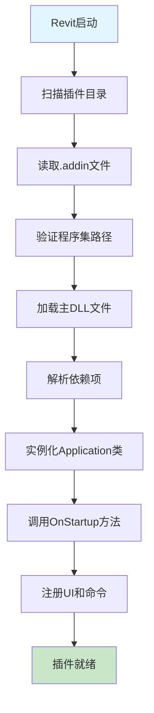

# Revit 插件部署指南

## 📋 Revit Addin 执行关系详解

### 1. 插件加载流程



### 2. 文件结构和依赖关系

#### 核心文件组成
- **`.addin` 清单文件**: 告诉Revit插件的位置和入口点
- **主程序集**: `GravityDamAnalysis.Revit.dll` - 插件入口点
- **业务逻辑**: `GravityDamAnalysis.Core.dll` - 核心业务模型
- **计算引擎**: `GravityDamAnalysis.Calculation.dll` - 稳定性分析算法
- **基础设施**: `GravityDamAnalysis.Infrastructure.dll` - Revit API集成
- **报告模块**: `GravityDamAnalysis.Reports.dll` - 报告生成
- **配置文件**: `appsettings.json` - 运行时配置

#### 依赖加载顺序
```
1. .NET Runtime 加载
2. Revit API 引用
3. GravityDamAnalysis.Core.dll
4. GravityDamAnalysis.Calculation.dll  
5. GravityDamAnalysis.Infrastructure.dll
6. GravityDamAnalysis.Reports.dll
7. GravityDamAnalysis.Revit.dll (主程序集)
```

### 3. .addin 清单文件解析

```xml
<?xml version="1.0" encoding="utf-8"?>
<RevitAddIns>
  <AddIn Type="Application">
    <!-- 程序集路径（相对于.addin文件位置） -->
    <Assembly>GravityDamAnalysis.Revit.dll</Assembly>
    
    <!-- 应用程序入口类的完整名称 -->
    <FullClassName>GravityDamAnalysis.Revit.Application.DamAnalysisApplication</FullClassName>
    
    <!-- 插件名称和描述 -->
    <n>Gravity Dam Stability Analysis</n>
    <Description>Revit plugin for gravity dam structural stability analysis</Description>
    
    <!-- 唯一标识符 -->
    <AddInId>A7C4F2E1-B8D6-4A3E-9F1C-2D5E8B7A0C3F</AddInId>
    
    <!-- 可见性模式 -->
    <VisibilityMode>AlwaysVisible</VisibilityMode>
  </AddIn>
</RevitAddIns>
```

## 🛠️ 脚本使用指南

### 快速收集脚本 (`quick-collect.ps1`)

#### 基本使用
```powershell
# 收集Debug版本的文件
.\quick-collect.ps1

# 收集Release版本的文件
.\quick-collect.ps1 -Config Release

# 直接部署到Revit
.\quick-collect.ps1 -Deploy

# 收集Release版本并部署
.\quick-collect.ps1 -Config Release -Deploy
```

#### 输出结果
- 创建 `bin\collected` 目录
- 复制所有必需的DLL文件
- 包含配置文件
- 可选择直接部署到Revit

### 完整收集脚本 (`collect-plugin-files.ps1`)

#### 高级用法
```powershell
# 开发环境收集（默认）
.\collect-plugin-files.ps1

# 生产环境发布包
.\collect-plugin-files.ps1 -Configuration Release -Target Production -Platform x64

# 测试环境部署
.\collect-plugin-files.ps1 -Configuration Debug -Target Testing -DeployToRevit

# 指定Revit版本
.\collect-plugin-files.ps1 -RevitVersion 2026 -DeployToRevit

# 自定义输出目录
.\collect-plugin-files.ps1 -OutputDir "deployment" -Target Production
```

#### 参数说明
- **Configuration**: `Debug` | `Release` - 构建配置
- **Platform**: `AnyCPU` | `x64` - 目标平台
- **Target**: `Development` | `Testing` | `Production` - 部署目标
- **OutputDir**: 输出目录名称（默认: `bin`）
- **DeployToRevit**: 是否直接部署到Revit
- **RevitVersion**: Revit版本号（2023-2026）

#### 输出结构
```
bin/
├── Production-Release-x64/
│   ├── GravityDamAnalysis.Revit.dll
│   ├── GravityDamAnalysis.Core.dll
│   ├── GravityDamAnalysis.Calculation.dll
│   ├── GravityDamAnalysis.Infrastructure.dll
│   ├── GravityDamAnalysis.Reports.dll
│   ├── GravityDamAnalysis.addin
│   ├── appsettings.json
│   └── deployment-report.txt
└── packages/
    └── GravityDamAnalysis-Production-Release-x64-20241215.zip
```

## 📂 Revit 插件目录结构

### 标准安装位置
```
%APPDATA%\Autodesk\Revit\Addins\[版本号]\
├── GravityDamAnalysis.addin          # 插件清单文件
└── GravityDamAnalysis\               # 插件文件夹
    ├── GravityDamAnalysis.Revit.dll
    ├── GravityDamAnalysis.Core.dll
    ├── GravityDamAnalysis.Calculation.dll
    ├── GravityDamAnalysis.Infrastructure.dll
    ├── GravityDamAnalysis.Reports.dll
    └── appsettings.json
```

### 版本对应关系
- **Revit 2023**: `%APPDATA%\Autodesk\Revit\Addins\2023\`
- **Revit 2024**: `%APPDATA%\Autodesk\Revit\Addins\2024\`
- **Revit 2025**: `%APPDATA%\Autodesk\Revit\Addins\2025\`
- **Revit 2026**: `%APPDATA%\Autodesk\Revit\Addins\2026\`

## 🔧 开发工作流程

### 1. 开发阶段
```powershell
# 编译项目
dotnet build --configuration Debug

# 快速收集和部署
.\quick-collect.ps1 -Deploy

# 启动Revit测试
```

### 2. 测试阶段
```powershell
# 创建测试包
.\collect-plugin-files.ps1 -Configuration Debug -Target Testing

# 部署到多个Revit版本
.\collect-plugin-files.ps1 -RevitVersion 2024 -DeployToRevit
.\collect-plugin-files.ps1 -RevitVersion 2025 -DeployToRevit
```

### 3. 发布阶段
```powershell
# 创建生产发布包
.\collect-plugin-files.ps1 -Configuration Release -Target Production -Platform x64

# 生成的包文件可直接分发给最终用户
```

## 🚨 常见问题和解决方案

### 问题1: 找不到DLL文件
**现象**: 脚本报告缺少某些DLL文件
**解决**: 
1. 确保项目已成功编译
2. 检查构建配置是否正确
3. 验证项目引用关系

### 问题2: Revit无法加载插件
**现象**: 插件在Revit中不显示
**解决**:
1. 检查.addin文件是否在正确位置
2. 验证Assembly路径是否正确
3. 确保所有依赖DLL都在同一目录

### 问题3: 权限不足
**现象**: 脚本无法复制文件到Revit目录
**解决**:
1. 以管理员身份运行PowerShell
2. 检查Revit目录的写入权限
3. 暂时关闭杀毒软件

### 问题4: 版本兼容性
**现象**: 插件在某些Revit版本中无法工作
**解决**:
1. 检查Revit API版本引用
2. 确保.NET版本兼容性
3. 验证平台目标设置（x64）

## 📋 部署检查清单

### 开发环境检查
- [ ] 项目编译成功，无错误和警告
- [ ] 所有单元测试通过
- [ ] DLL文件完整，无缺失
- [ ] 配置文件正确

### 部署前检查
- [ ] .addin文件路径正确
- [ ] Assembly和FullClassName匹配
- [ ] 所有依赖项已包含
- [ ] 目标Revit版本支持

### 部署后验证
- [ ] Revit能正常启动
- [ ] 插件在功能区中显示
- [ ] 命令可以正常执行
- [ ] 日志文件无异常

## 💡 最佳实践

1. **版本管理**: 为不同Revit版本维护单独的构建
2. **依赖隔离**: 避免与其他插件的DLL冲突
3. **配置外化**: 使用配置文件管理可变参数
4. **错误处理**: 完善的异常处理和日志记录
5. **用户文档**: 提供清晰的安装和使用指南

---

通过这些脚本和指南，您可以高效地管理Revit插件的构建、收集和部署过程，确保插件在不同环境中的可靠运行。 