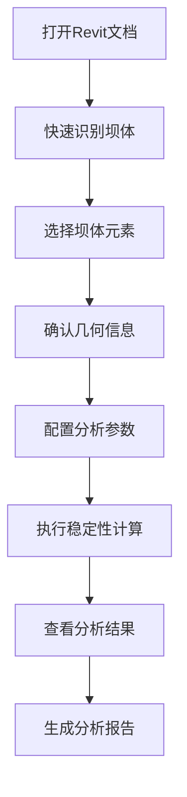

# 重力坝稳定性分析插件

[](https://dotnet.microsoft.com/)
[](https://www.autodesk.com/products/revit/)
[](LICENSE)

## 项目概述

重力坝稳定性分析插件是为 Autodesk Revit 开发的专业工程分析工具，专门用于重力坝结构的稳定性分析。插件集成了智能坝体识别、参数化分析配置和专业的稳定性计算功能，为水利工程师提供了便捷高效的分析工具。

## 🚀 核心功能

### 智能坝体识别
- 自动搜索和识别 Revit 文档中的重力坝实体
- 基于几何特征和命名规则的智能评分系统
- 支持体量、结构构件、墙体等多种元素类型

### 专业稳定性分析
- **抗滑稳定性分析**: 基于摩擦理论的滑移稳定性计算
- **抗倾覆稳定性分析**: 力矩平衡的倾覆稳定性评估
- **多工况分析**: 支持静力、动力（地震）等不同工况
- **扬压力计算**: 考虑坝底扬压力影响

### 参数化配置
- **预设模板**: 常规重力坝、高坝大库、中低坝、抗震设计等模板
- **智能默认值**: 根据坝体特征自动设置合理的分析参数
- **灵活配置**: 支持水位、材料、安全系数等全参数自定义

### 结果可视化
- 详细的分析报告生成
- 直观的安全系数显示
- 专业的工程建议
- 完整的计算过程记录

## 🏗️ 项目架构

```
GravityDamAnalysis/
├── src/
│   ├── GravityDamAnalysis.Core/          # 核心实体和服务接口
│   ├── GravityDamAnalysis.Calculation/   # 稳定性分析计算引擎
│   ├── GravityDamAnalysis.Infrastructure/ # Revit 数据提取和基础设施
│   ├── GravityDamAnalysis.Reports/       # 报告生成服务
│   ├── GravityDamAnalysis.Revit/         # Revit 插件主体
│   └── GravityDamAnalysis.UI/            # 用户界面组件
└── tests/                                # 单元测试
```

### 技术栈
- **.NET 8.0**: 现代化的跨平台框架
- **Revit API 2025**: 与 Autodesk Revit 的深度集成
- **Microsoft Extensions**: 依赖注入、日志记录、配置管理
- **Serilog**: 结构化日志记录
- **xUnit**: 单元测试框架

## 📦 安装和部署

### 系统要求
- Autodesk Revit 2025 或更高版本
- .NET 8.0 Runtime
- Windows 10/11 操作系统

### 构建和安装

1. **克隆仓库**
   ```bash
   git clone https://github.com/your-repo/GravityDamAnalysis.git
   cd GravityDamAnalysis
   ```

2. **运行构建脚本**
   ```powershell
   .\build.ps1
   ```

3. **手动构建（可选）**
   ```bash
   dotnet restore
   dotnet build --configuration Release --platform x64
   dotnet test
   ```

构建脚本会自动：
- 编译整个解决方案
- 运行单元测试
- 将插件文件部署到 Revit 插件目录
- 创建发布包

## 🎯 使用指南

### 快速开始

1. **启动 Revit** 并打开包含坝体模型的文档
2. **找到"重力坝分析"选项卡** 在 Revit 功能区中
3. **点击"快速识别坝体"** 自动搜索潜在的坝体元素
4. **点击"坝体稳定性分析"** 开始详细的稳定性分析

### 分析流程



详细使用说明请参考 [使用指南](Usage_Guide.md)。

## 🧪 测试和质量保证

项目包含完整的单元测试覆盖：

```bash
dotnet test --logger:"console;verbosity=detailed"
```

测试覆盖范围：
- 核心实体验证逻辑
- 稳定性分析算法
- 数据提取和转换
- 参数验证机制

## 📊 计算方法

### 抗滑稳定性

安全系数计算公式：
```
Fs = (W × f + C × A) / (H + U × tan(φ))
```

其中：
- W: 坝体自重
- f: 摩擦系数
- C: 黏聚力
- A: 接触面积
- H: 水平力
- U: 扬压力
- φ: 内摩擦角

### 抗倾覆稳定性

安全系数计算公式：
```
Fo = ΣM_r / ΣM_o
```

其中：
- ΣM_r: 抗倾覆力矩总和
- ΣM_o: 倾覆力矩总和

## 🤝 贡献指南

欢迎贡献代码！请遵循以下步骤：

1. Fork 本仓库
2. 创建特性分支 (`git checkout -b feature/AmazingFeature`)
3. 提交更改 (`git commit -m 'Add some AmazingFeature'`)
4. 推送到分支 (`git push origin feature/AmazingFeature`)
5. 创建 Pull Request

### 开发规范

- 遵循 C# 编码规范
- 编写单元测试覆盖新功能
- 更新相关文档
- 确保所有测试通过

## 📄 许可证

本项目采用 MIT 许可证 - 详见 [LICENSE](LICENSE) 文件。

## 🆘 支持和反馈

- **问题报告**: 使用 GitHub Issues
- **功能请求**: 通过 Issues 提交功能需求
- **讨论交流**: 参与 Discussions 讨论

## 🏆 致谢

感谢所有为本项目做出贡献的开发者和工程师。

---

**注意**: 本插件仅用于辅助工程分析，实际工程设计应结合专业规范和工程师判断。 