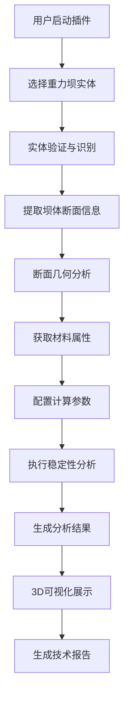

# 重力坝稳定性分析 Revit 插件架构设计 v2.0
## 基于 .NET 8 + Revit 2025/2026 + 业务流程导向

## 1. 架构概述

### 1.1 核心业务流程


### 1.2 分层架构设计

```
┌─────────────────────────────────────────────────────────────┐
│                    用户交互层 (UI Layer)                      │
├─────────────────┬─────────────────┬─────────────────────────┤
│   实体选择界面   │    断面配置界面  │    结果展示界面          │
│   (Selection)   │   (Section)     │   (Results)             │
└─────────────────┴─────────────────┴─────────────────────────┘
┌─────────────────────────────────────────────────────────────┐
│                   业务服务层 (Service Layer)                 │
├─────────────────┬─────────────────┬─────────────────────────┤
│   实体识别服务   │    断面分析服务  │    计算编排服务          │
│   (Recognition) │   (Analysis)    │   (Orchestration)       │
└─────────────────┴─────────────────┴─────────────────────────┘
┌─────────────────────────────────────────────────────────────┐
│                   核心计算层 (Calculation Layer)             │
├─────────────────┬─────────────────┬─────────────────────────┤
│   稳定性计算引擎 │    断面几何计算  │    结果处理引擎          │
│   (Stability)   │   (Geometry)    │   (Processing)          │
└─────────────────┴─────────────────┴─────────────────────────┘
┌─────────────────────────────────────────────────────────────┐
│                   数据访问层 (Data Access Layer)             │
├─────────────────┬─────────────────┬─────────────────────────┤
│   Revit数据提取  │    断面数据缓存  │    配置管理              │
│   (RevitAPI)    │   (SectionCache)│   (Configuration)       │
└─────────────────┴─────────────────┴─────────────────────────┘
```

## 2. 基于 .NET 8 的现代化设计

### 2.1 核心技术栈
```csharp
// .NET 8 项目文件示例
<Project Sdk="Microsoft.NET.Sdk">
  <PropertyGroup>
    <TargetFramework>net8.0-windows</TargetFramework>
    <UseWPF>true</UseWPF>
    <UseWindowsForms>false</UseWindowsForms>
    <Nullable>enable</Nullable>
    <ImplicitUsings>enable</ImplicitUsings>
    <TreatWarningsAsErrors>true</TreatWarningsAsErrors>
  </PropertyGroup>
  
  <ItemGroup>
    <PackageReference Include="Autodesk.Revit.SDK" Version="2025.0.0" />
    <PackageReference Include="Microsoft.Extensions.Hosting" Version="8.0.0" />
    <PackageReference Include="Microsoft.Extensions.DependencyInjection" Version="8.0.0" />
    <PackageReference Include="Microsoft.Extensions.Configuration" Version="8.0.0" />
    <PackageReference Include="Microsoft.Extensions.Logging" Version="8.0.0" />
    <PackageReference Include="Serilog.Extensions.Hosting" Version="8.0.0" />
    <PackageReference Include="CommunityToolkit.Mvvm" Version="8.2.2" />
    <PackageReference Include="HelixToolkit.Wpf" Version="2.25.0" />
    <PackageReference Include="MathNet.Numerics" Version="5.0.0" />
  </ItemGroup>
</Project>
```

### 2.2 现代化服务容器配置
```csharp
// 使用 .NET 8 的依赖注入和配置系统
public class DamAnalysisHost
{
    public static IHost CreateHost()
    {
        return Host.CreateDefaultBuilder()
            .ConfigureServices((context, services) =>
            {
                // 配置服务
                services.Configure<AnalysisSettings>(
                    context.Configuration.GetSection("AnalysisSettings"));
                services.Configure<RevitSettings>(
                    context.Configuration.GetSection("RevitSettings"));
                
                // 注册业务服务
                services.AddScoped<IDamEntityRecognitionService, DamEntityRecognitionService>();
                services.AddScoped<ISectionAnalysisService, SectionAnalysisService>();
                services.AddScoped<IStabilityCalculationService, StabilityCalculationService>();
                services.AddScoped<IResultVisualizationService, ResultVisualizationService>();
                
                // 注册数据访问
                services.AddScoped<IRevitDataExtractor, ModernRevitDataExtractor>();
                services.AddSingleton<ISectionDataCache, RedisSectionDataCache>();
                
                // 注册UI组件
                services.AddTransient<MainViewModel>();
                services.AddTransient<SectionConfigurationViewModel>();
                services.AddTransient<ResultsViewModel>();
                
                // 添加日志
                services.AddLogging(builder => builder.AddSerilog());
            })
            .UseSerilog((context, config) =>
            {
                config.ReadFrom.Configuration(context.Configuration);
            })
            .Build();
    }
}
```

## 3. 业务流程导向的服务设计

### 3.1 实体识别服务
```csharp
// 专门负责识别和验证重力坝实体
public interface IDamEntityRecognitionService
{
    Task<DamEntity?> RecognizeSelectedEntity(Element selectedElement);
    Task<List<DamEntity>> FindAllDamEntities(Document document);
    Task<bool> ValidateDamEntity(DamEntity entity);
    Task<DamClassification> ClassifyDamType(DamEntity entity);
}

public class DamEntityRecognitionService : IDamEntityRecognitionService
{
    private readonly IRevitDataExtractor _dataExtractor;
    private readonly ILogger<DamEntityRecognitionService> _logger;
    
    public async Task<DamEntity?> RecognizeSelectedEntity(Element selectedElement)
    {
        _logger.LogInformation("开始识别选中的实体: {ElementId}", selectedElement.Id);
        
        // 1. 检查实体类型
        if (!IsPotentialDamElement(selectedElement))
        {
            _logger.LogWarning("选中的实体不是有效的坝体元素");
            return null;
        }
        
        // 2. 提取基本几何信息
        var geometry = await ExtractBasicGeometry(selectedElement);
        if (geometry == null)
        {
            _logger.LogWarning("无法从选中实体提取几何信息");
            return null;
        }
        
        // 3. 分析几何特征确定是否为重力坝
        var classification = await AnalyzeDamCharacteristics(geometry);
        
        // 4. 创建坝体实体对象
        var damEntity = new DamEntity
        {
            RevitElement = selectedElement,
            Geometry = geometry,
            Classification = classification,
            Id = selectedElement.Id.IntegerValue,
            Name = selectedElement.Name ?? $"重力坝_{selectedElement.Id}"
        };
        
        _logger.LogInformation("成功识别重力坝实体: {DamName}", damEntity.Name);
        return damEntity;
    }
    
    private bool IsPotentialDamElement(Element element)
    {
        // 检查类别
        var category = element.Category;
        if (category == null) return false;
        
        var validCategories = new[]
        {
            BuiltInCategory.OST_StructuralFraming,
            BuiltInCategory.OST_Mass,
            BuiltInCategory.OST_GenericModel,
            BuiltInCategory.OST_Walls // Revit 2025/2026 可能用墙体建模
        };
        
        return validCategories.Contains((BuiltInCategory)category.Id.IntegerValue);
    }
}
```

### 3.2 断面分析服务
```csharp
// 专门处理断面信息提取和分析
public interface ISectionAnalysisService
{
    Task<List<DamSection>> ExtractDamSections(DamEntity damEntity, SectionExtractionOptions options);
    Task<SectionGeometry> AnalyzeSectionGeometry(DamSection section);
    Task<List<DamSection>> GenerateAnalysisSections(DamEntity damEntity, int sectionCount = 5);
    Task<SectionProperties> CalculateSectionProperties(DamSection section);
}

public class SectionAnalysisService : ISectionAnalysisService
{
    private readonly IRevitDataExtractor _dataExtractor;
    private readonly ISectionDataCache _cache;
    private readonly ILogger<SectionAnalysisService> _logger;
    
    public async Task<List<DamSection>> ExtractDamSections(DamEntity damEntity, SectionExtractionOptions options)
    {
        _logger.LogInformation("开始提取坝体断面，坝体ID: {DamId}", damEntity.Id);
        
        var sections = new List<DamSection>();
        
        // 1. 确定断面切割平面
        var cuttingPlanes = GenerateCuttingPlanes(damEntity, options);
        
        // 2. 对每个平面提取断面
        foreach (var plane in cuttingPlanes)
        {
            var section = await ExtractSectionAtPlane(damEntity, plane);
            if (section != null)
            {
                sections.Add(section);
            }
        }
        
        // 3. 验证断面数据完整性
        await ValidateSections(sections);
        
        _logger.LogInformation("成功提取 {Count} 个断面", sections.Count);
        return sections;
    }
    
    private async Task<DamSection?> ExtractSectionAtPlane(DamEntity damEntity, Plane cuttingPlane)
    {
        try
        {
            // 使用 Revit 2025/2026 的新几何API
            var geometryOptions = new Options
            {
                ComputeReferences = true,
                DetailLevel = ViewDetailLevel.Fine,
                IncludeNonVisibleObjects = false
            };
            
            var geometryElement = damEntity.RevitElement.get_Geometry(geometryOptions);
            var intersectionCurves = new List<Curve>();
            
            // 计算实体与切割平面的交线
            foreach (GeometryObject geometryObject in geometryElement)
            {
                if (geometryObject is Solid solid)
                {
                    var intersection = CalculatePlaneIntersection(solid, cuttingPlane);
                    intersectionCurves.AddRange(intersection);
                }
            }
            
            if (!intersectionCurves.Any())
            {
                return null;
            }
            
            // 构建断面轮廓
            var sectionProfile = BuildSectionProfile(intersectionCurves);
            
            return new DamSection
            {
                Id = Guid.NewGuid(),
                CuttingPlane = cuttingPlane,
                Profile = sectionProfile,
                Location = cuttingPlane.Origin,
                Normal = cuttingPlane.Normal
            };
        }
        catch (Exception ex)
        {
            _logger.LogError(ex, "提取断面时发生错误");
            return null;
        }
    }
    
    public async Task<SectionGeometry> AnalyzeSectionGeometry(DamSection section)
    {
        // 分析断面几何特性
        var profile = section.Profile;
        
        // 计算关键几何参数
        var geometry = new SectionGeometry
        {
            // 坝顶宽度
            CrestWidth = CalculateCrestWidth(profile),
            
            // 坝底宽度  
            BaseWidth = CalculateBaseWidth(profile),
            
            // 坝高
            Height = CalculateHeight(profile),
            
            // 上游坡度
            UpstreamSlope = CalculateUpstreamSlope(profile),
            
            // 下游坡度
            DownstreamSlope = CalculateDownstreamSlope(profile),
            
            // 断面面积
            Area = CalculateArea(profile),
            
            // 重心位置
            Centroid = CalculateCentroid(profile)
        };
        
        return geometry;
    }
}
```

### 3.3 现代化计算编排服务
```csharp
// 使用 .NET 8 的现代化异步编程和并行处理
public interface ICalculationOrchestrationService
{
    Task<AnalysisResult> ExecuteFullAnalysis(DamEntity damEntity, AnalysisParameters parameters);
    IAsyncEnumerable<PartialResult> ExecuteStreamingAnalysis(DamEntity damEntity, AnalysisParameters parameters);
    Task<bool> ValidateAnalysisReadiness(DamEntity damEntity);
}

public class CalculationOrchestrationService : ICalculationOrchestrationService
{
    private readonly ISectionAnalysisService _sectionService;
    private readonly IStabilityCalculationService _calculationService;
    private readonly ILogger<CalculationOrchestrationService> _logger;
    
    public async Task<AnalysisResult> ExecuteFullAnalysis(DamEntity damEntity, AnalysisParameters parameters)
    {
        using var activity = ActivitySource.StartActivity("DamAnalysis.FullAnalysis");
        activity?.SetTag("dam.id", damEntity.Id.ToString());
        
        _logger.LogInformation("开始完整分析流程，坝体: {DamName}", damEntity.Name);
        
        var result = new AnalysisResult { DamId = damEntity.Id };
        
        try
        {
            // 阶段1: 提取断面信息
            _logger.LogInformation("阶段1: 提取断面信息");
            var sections = await _sectionService.ExtractDamSections(damEntity, parameters.SectionOptions);
            result.Sections = sections;
            
            // 阶段2: 并行分析各断面
            _logger.LogInformation("阶段2: 并行分析 {Count} 个断面", sections.Count);
            var sectionTasks = sections.Select(async section =>
            {
                var geometry = await _sectionService.AnalyzeSectionGeometry(section);
                var stabilityResult = await _calculationService.CalculateStability(section, geometry, parameters);
                
                return new SectionAnalysisResult
                {
                    Section = section,
                    Geometry = geometry,
                    StabilityResult = stabilityResult
                };
            });
            
            var sectionResults = await Task.WhenAll(sectionTasks);
            result.SectionResults = sectionResults.ToList();
            
            // 阶段3: 整体分析
            _logger.LogInformation("阶段3: 整体稳定性分析");
            result.OverallStability = await _calculationService.CalculateOverallStability(sectionResults, parameters);
            
            // 阶段4: 生成综合评估
            _logger.LogInformation("阶段4: 生成综合评估");
            result.Assessment = GenerateAssessment(result);
            
            result.IsSuccess = true;
            _logger.LogInformation("分析完成，总体安全系数: {SafetyFactor}", result.OverallStability.SafetyFactor);
            
            return result;
        }
        catch (Exception ex)
        {
            _logger.LogError(ex, "分析过程中发生错误");
            result.IsSuccess = false;
            result.ErrorMessage = ex.Message;
            return result;
        }
    }
    
    // .NET 8 的异步流特性，支持实时结果推送
    public async IAsyncEnumerable<PartialResult> ExecuteStreamingAnalysis(
        DamEntity damEntity, 
        AnalysisParameters parameters,
        [EnumeratorCancellation] CancellationToken cancellationToken = default)
    {
        _logger.LogInformation("开始流式分析");
        
        // 实时推送断面提取进度
        await foreach (var section in ExtractSectionsStreaming(damEntity, parameters.SectionOptions, cancellationToken))
        {
            yield return new PartialResult
            {
                Type = PartialResultType.SectionExtracted,
                Data = section,
                Progress = CalculateProgress(section)
            };
        }
        
        // 实时推送计算结果
        var sections = await _sectionService.ExtractDamSections(damEntity, parameters.SectionOptions);
        
        await foreach (var result in CalculateStabilityStreaming(sections, parameters, cancellationToken))
        {
            yield return result;
        }
    }
    
    private async IAsyncEnumerable<DamSection> ExtractSectionsStreaming(
        DamEntity damEntity, 
        SectionExtractionOptions options,
        [EnumeratorCancellation] CancellationToken cancellationToken)
    {
        var cuttingPlanes = GenerateCuttingPlanes(damEntity, options);
        
        foreach (var plane in cuttingPlanes)
        {
            cancellationToken.ThrowIfCancellationRequested();
            
            var section = await ExtractSectionAtPlane(damEntity, plane);
            if (section != null)
            {
                yield return section;
            }
        }
    }
}
```

## 4. Revit 2025/2026 特定优化

### 4.1 新API特性利用
```csharp
// 利用 Revit 2025/2026 的新特性
public class ModernRevitDataExtractor : IRevitDataExtractor
{
    // 使用新的几何分析API
    public async Task<GeometryAnalysisResult> AnalyzeGeometryAsync(Element element)
    {
        // Revit 2025+ 的异步几何计算支持
        var options = new Options
        {
            ComputeReferences = true,
            DetailLevel = ViewDetailLevel.Fine,
            IncludeNonVisibleObjects = false
        };
        
        // 新的几何分析器
        var analyzer = new GeometryAnalyzer();
        var result = await analyzer.AnalyzeAsync(element, options);
        
        return result;
    }
    
    // 利用改进的材料API
    public MaterialProperties ExtractMaterialProperties(Element element)
    {
        var materialIds = element.GetMaterialIds(false);
        var properties = new MaterialProperties();
        
        foreach (var materialId in materialIds)
        {
            var material = element.Document.GetElement(materialId) as Material;
            if (material != null)
            {
                // Revit 2025+ 的增强材料属性
                var structuralAsset = material.GetStructuralAsset();
                if (structuralAsset != null)
                {
                    properties.Density = structuralAsset.Density;
                    properties.YoungModulus = structuralAsset.YoungModulus.X;
                    properties.PoissonRatio = structuralAsset.PoissonRatio.X;
                    
                    // 新增的高级材料属性
                    properties.CompressiveStrength = structuralAsset.ConcreteCompression;
                    properties.TensileStrength = structuralAsset.ConcreteTension;
                }
            }
        }
        
        return properties;
    }
}
```

### 4.2 性能优化策略
```csharp
// 使用 .NET 8 的现代化缓存和性能优化
public class HighPerformanceSectionCache : ISectionDataCache
{
    private readonly IMemoryCache _memoryCache;
    private readonly IDistributedCache _distributedCache;
    private readonly ILogger<HighPerformanceSectionCache> _logger;
    
    // 使用 System.Text.Json 的高性能序列化
    private static readonly JsonSerializerOptions JsonOptions = new()
    {
        PropertyNamingPolicy = JsonNamingPolicy.CamelCase,
        WriteIndented = false,
        DefaultIgnoreCondition = JsonIgnoreCondition.WhenWritingNull
    };
    
    public async Task<T?> GetAsync<T>(string key) where T : class
    {
        // 先查内存缓存
        if (_memoryCache.TryGetValue(key, out T? cached))
        {
            return cached;
        }
        
        // 再查分布式缓存
        var json = await _distributedCache.GetStringAsync(key);
        if (json != null)
        {
            var result = JsonSerializer.Deserialize<T>(json, JsonOptions);
            
            // 写回内存缓存
            _memoryCache.Set(key, result, TimeSpan.FromMinutes(10));
            
            return result;
        }
        
        return null;
    }
    
    public async Task SetAsync<T>(string key, T value, TimeSpan expiration) where T : class
    {
        // 内存缓存
        _memoryCache.Set(key, value, expiration);
        
        // 分布式缓存
        var json = JsonSerializer.Serialize(value, JsonOptions);
        await _distributedCache.SetStringAsync(key, json, new DistributedCacheEntryOptions
        {
            AbsoluteExpirationRelativeToNow = expiration
        });
    }
}
```

这个更新后的架构设计更加贴合您的实际业务流程，充分利用了.NET 8和Revit 2025/2026的现代化特性，提供了更好的性能和用户体验。 