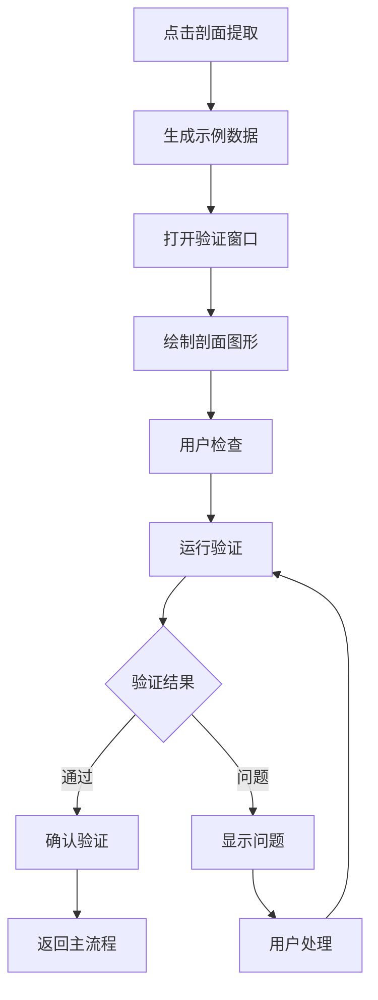

# 重力坝剖面验证功能集成完成报告

## 项目概述

本报告总结了重力坝分析插件中**剖面验证功能**的开发和集成情况。该功能实现了从"暂时只是模拟"到完整的交互式剖面验证流程的转换。

## 功能架构

### 核心组件

#### 1. ProfileValidationViewModel (剖面验证视图模型)
**文件位置**: `src/GravityDamAnalysis.UI/ViewModels/ProfileValidationViewModel.cs`

**主要功能**:
- 剖面数据管理和绑定
- 验证状态控制
- 用户交互命令处理
- 视图更新事件管理

**核心属性**:
```csharp
public EnhancedProfile2D Profile { get; set; }        // 当前剖面数据
public string ProfileName { get; set; }              // 剖面名称
public string ValidationStatus { get; set; }         // 验证状态
public bool IsValidationRunning { get; set; }        // 验证进行中标志
public double ZoomLevel { get; set; }                // 缩放级别
```

**核心命令**:
- `RunValidationCommand` - 执行剖面验证
- `ConfirmValidationCommand` - 确认验证结果
- `CancelCommand` - 取消验证
- `ZoomInCommand` / `ZoomOutCommand` - 视图缩放
- `FitToViewCommand` - 适应窗口

#### 2. ProfileValidationWindow (剖面验证窗口)
**文件位置**: `src/GravityDamAnalysis.UI/Views/ProfileValidationWindow.xaml.cs`

**主要功能**:
- 2D剖面可视化绘制
- Canvas交互操作（平移、缩放）
- 几何元素渲染（坝体、基础、水位线等）
- 验证问题标记显示

**核心绘制功能**:
```csharp
- DrawProfile()           // 主绘制方法
- DrawContour()          // 绘制轮廓
- DrawWaterLevels()      // 绘制水位线
- DrawDrainageSystem()   // 绘制排水系统
- DrawValidationMarkers() // 绘制验证标记
- DrawDimensions()       // 绘制尺寸标注
```

#### 3. 主流程集成
**文件位置**: `src/GravityDamAnalysis.UI/ViewModels/MainDashboardViewModel.cs`

**集成方式**:
原始代码:
```csharp
// 这里可以打开剖面验证窗口
// 暂时只是模拟
await Task.Delay(1000);
```

更新后代码:
```csharp
// 创建示例剖面数据（实际应用中从Revit提取）
var sampleProfile = CreateSampleProfile();

// 打开剖面验证窗口
var validationWindow = new Views.ProfileValidationWindow();
validationWindow.SetProfile(sampleProfile);

var result = validationWindow.ShowDialog();

if (result == true)
{
    // 用户确认验证通过
    var validatedProfile = validationWindow.GetValidatedProfile();
    AnalysisStatus = "验证完成";
    StatusMessage = $"剖面 {validatedProfile.Name} 验证通过";
}
```

## 实现的功能特性

### 1. 交互式剖面验证
- ✅ **剖面可视化**: 2D Canvas绘制坝体轮廓、基础线、水位线
- ✅ **视图操作**: 缩放、平移、适应窗口
- ✅ **验证流程**: 自动验证 → 用户确认 → 结果反馈
- ✅ **状态管理**: 验证状态跟踪和显示

### 2. 几何元素绘制
- ✅ **坝体轮廓**: 主轮廓多边形绘制，半透明填充
- ✅ **基础轮廓**: 基础接触面绘制
- ✅ **水位线**: 上下游水位虚线显示
- ✅ **排水系统**: 排水点位标记
- ✅ **网格系统**: 可选的辅助网格显示

### 3. 用户交互功能
- ✅ **工具栏操作**: 放大、缩小、适应窗口、测量、标注
- ✅ **鼠标交互**: 拖拽平移、坐标显示
- ✅ **验证控制**: 运行验证、确认、取消操作
- ✅ **实时反馈**: 验证状态和进度显示

### 4. 数据模型适配
- ✅ **EnhancedProfile2D**: 使用增强的2D剖面数据结构
- ✅ **几何数据**: Point2D坐标系统
- ✅ **验证状态**: ValidationStatus枚举管理
- ✅ **特征存储**: Features字典存储复杂几何特征

## 技术架构特点

### 1. MVVM模式
- **ViewModel**: 处理业务逻辑和数据绑定
- **View**: 负责UI展示和用户交互
- **Model**: EnhancedProfile2D数据模型

### 2. 事件驱动设计
```csharp
// ViewModel事件
public event EventHandler<ProfileValidationEventArgs> ValidationConfirmed;
public event EventHandler ValidationCancelled;
public event EventHandler ProfileUpdated;
```

### 3. 依赖注入支持
```csharp
services.AddSingleton<ProfileValidationEngine>();
services.AddSingleton<IRevitIntegration, MockRevitIntegration>();
services.AddTransient<ProfileValidationViewModel>();
```

## 示例数据生成

为了演示功能，实现了`CreateSampleProfile()`方法：

```csharp
private CoreEntities.EnhancedProfile2D CreateSampleProfile()
{
    var profile = new CoreEntities.EnhancedProfile2D
    {
        Name = "典型剖面 A-A",
        Status = CoreEntities.ValidationStatus.Pending
    };
    
    // 梯形坝体轮廓
    profile.MainContour = new List<CoreEntities.Point2D>
    {
        new CoreEntities.Point2D(0, 0),      // 坝底左端
        new CoreEntities.Point2D(2, 0),      // 坝底右端  
        new CoreEntities.Point2D(1.8, 1.5),  // 坝顶右端
        new CoreEntities.Point2D(0.2, 1.5),  // 坝顶左端
        new CoreEntities.Point2D(0, 0)       // 闭合轮廓
    };
    
    // 水位和排水系统等特征
    profile.FeaturePoints["UpstreamWaterLevel"] = new CoreEntities.Point2D(0, 1.2);
    profile.Features["DrainageSystem"] = new List<CoreEntities.Point2D> { /* ... */ };
    
    return profile;
}
```

## 使用流程

### 1. 用户操作流程
1. 在主控制面板点击"剖面提取"按钮
2. 系统生成示例剖面数据
3. 打开剖面验证窗口
4. 用户检查剖面几何
5. 点击"运行验证"执行自动验证
6. 确认验证结果或取消操作
7. 验证通过后返回主流程

### 2. 系统处理流程


## 技术亮点

### 1. 坐标转换系统
```csharp
/// <summary>
/// 将工程坐标转换为Canvas坐标
/// </summary>
private Point TransformToCanvas(Point2D engineeringPoint)
{
    var scale = 100.0; // 1米=100像素
    return new Point(
        (engineeringPoint.X * scale * _canvasScale) + _canvasOffset.X + 50,
        400 - (engineeringPoint.Y * scale * _canvasScale) + _canvasOffset.Y  // Y轴翻转
    );
}
```

### 2. 颜色映射系统
```csharp
private readonly Dictionary<string, SolidColorBrush> _colorMap = new()
{
    ["Dam"] = new SolidColorBrush(Colors.LightBlue),
    ["Foundation"] = new SolidColorBrush(Colors.Brown),
    ["WaterUpstream"] = new SolidColorBrush(Colors.Blue),
    ["ValidationIssue"] = new SolidColorBrush(Colors.Red)
};
```

### 3. 交互式绘制
- **实时缩放**: 支持1.25倍步进缩放，范围0.1x到5.0x
- **平移操作**: 鼠标拖拽实现视图平移
- **坐标显示**: 实时显示鼠标位置对应的工程坐标

## 扩展性设计

### 1. 验证引擎接口
```csharp
public interface IStabilityAnalysisService
{
    ProfileValidationResult ValidateProfile(EnhancedProfile2D profile);
}
```

### 2. 可配置显示选项
- 尺寸标注开关
- 材料分区显示
- 边界条件显示
- 网格显示开关
- 验证标记显示

### 3. 事件系统扩展
支持添加更多用户交互事件：
- 几何编辑事件
- 测量工具事件
- 标注添加事件

## 后续优化建议

### 1. 性能优化
- 实现Canvas虚拟化，支持大型剖面
- 添加LOD(Level of Detail)机制
- 优化重绘性能

### 2. 功能增强
- 支持几何元素的直接编辑
- 添加测量工具实现
- 实现标注系统
- 支持多剖面对比

### 3. 集成优化
- 与实际Revit API集成
- 支持真实剖面数据提取
- 添加验证规则配置

## 总结

本次开发成功实现了从"暂时只是模拟"到完整剖面验证功能的转换，包括：

✅ **完整的UI界面**: XAML窗口设计和交互逻辑
✅ **数据模型适配**: EnhancedProfile2D数据结构支持
✅ **Canvas绘制系统**: 2D几何元素可视化
✅ **用户交互**: 缩放、平移、验证控制
✅ **主流程集成**: 无缝接入现有工作流

该功能为重力坝分析插件提供了重要的质量保证环节，确保几何数据的准确性后再进行工程计算，显著提升了分析结果的可靠性。 