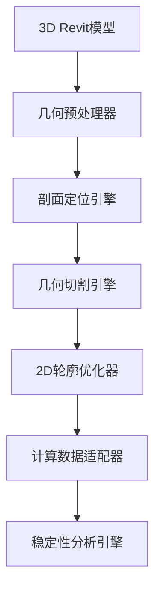

# 重力坝二维剖面提取计算需求分析文档

## 🎯 架构分析

### 核心挑战拆解
在重力坝稳定性分析中，**从三维Revit模型提取二维剖面**是连接BIM数据与工程计算的关键环节。这个过程需要解决以下核心问题：

1. **几何降维转换**: 将复杂的三维坝体几何转换为可计算的二维剖面
2. **剖面定位策略**: 确定关键分析剖面的位置和方向
3. **边界条件识别**: 自动识别坝体-基岩、坝体-水体接触面
4. **几何精度保持**: 确保转换过程中几何信息的准确性

### 当前实现现状分析

#### 现有剖面生成器分析
当前的`SectionPlaneGenerator`类采用了以下方法：

1. **剖面平面创建**: 基于法向量和偏移距离创建切割平面
2. **几何切割**: 使用"薄片实体"方法进行布尔运算
3. **2D转换**: 将3D曲线循环投影到2D坐标系

#### 发现的技术问题

**问题1: 几何切割效率低下**
```csharp
// 当前实现：创建薄片实体进行布尔运算
var profileThickness = 0.01; // 0.01英尺的薄片
var profileSolid = CreateProfileSolid(sectionPlane, solid.GetBoundingBox(), profileThickness);

// 执行布尔相交运算
var intersection = BooleanOperationsUtils.ExecuteBooleanOperation(
    solid, profileSolid, BooleanOperationsType.Intersect);
```

**问题分析**:
- ❌ 创建额外的3D实体增加内存开销
- ❌ 布尔运算在复杂几何上可能失败
- ❌ 计算精度受薄片厚度影响

**问题2: 数据结构不完整**
当前的`DamSection`类缺少工程计算所需的关键信息：
- 缺少材料分区信息
- 缺少边界条件定义
- 缺少水位线交点
- 缺少几何特征点识别

## 🛠️ 设计建议

### 1. 核心架构方案

基于当前代码分析，建议采用**分层几何处理架构**：



### 2. 关键技术改进方案

#### 📐 几何切割算法优化

**改进方案**：采用直接几何求交算法

```csharp
/// <summary>
/// 改进的剖面提取算法 - 直接Face-Plane求交
/// </summary>
public List<CurveLoop> ExtractSectionCurvesOptimized(Solid solid, Plane sectionPlane)
{
    var intersectionCurves = new List<Curve>();
    
    // 遍历实体的每个面
    foreach (Face face in solid.Faces)
    {
        // 计算面与平面的交线
        var intersection = face.Intersect(sectionPlane);
        if (intersection == SetComparisonResult.Overlap)
        {
            // 获取交线曲线
            var curves = face.GetEdgesAsCurveLoops()
                .SelectMany(loop => loop.Cast<Curve>())
                .Where(curve => IsOnPlane(curve, sectionPlane, TOLERANCE));
            
            intersectionCurves.AddRange(curves);
        }
    }
    
    // 组织成连续的CurveLoop
    return OrganizeCurvesIntoCurveLoops(intersectionCurves);
}
```

**优势**:
- ✅ 直接几何运算，无需创建辅助实体
- ✅ 更高的计算精度
- ✅ 更好的性能表现
- ✅ 减少内存占用

#### 🎯 智能剖面定位策略

**新增需求**：自动识别关键分析剖面位置

```csharp
/// <summary>
/// 智能剖面定位器
/// 根据坝体几何特征自动确定关键分析剖面
/// </summary>
public class IntelligentSectionLocator
{
    public List<SectionLocation> IdentifyKeySections(DamEntity damEntity, AnalysisParameters parameters)
    {
        var sections = new List<SectionLocation>();
        
        // 1. 最大截面（通常是坝体最高处）
        sections.Add(FindMaxHeightSection(damEntity));
        
        // 2. 特征变化点（几何突变处）
        sections.AddRange(FindGeometryTransitions(damEntity));
        
        // 3. 荷载关键点（如溢洪道位置）
        sections.AddRange(FindLoadCriticalSections(damEntity));
        
        // 4. 用户自定义剖面
        if (parameters.CustomSectionLocations?.Any() == true)
        {
            sections.AddRange(parameters.CustomSectionLocations);
        }
        
        return OptimizeSectionDistribution(sections);
    }
    
    private SectionLocation FindMaxHeightSection(DamEntity damEntity)
    {
        var bbox = damEntity.Geometry.BoundingBox;
        var centerLine = new Line3D(
            new Point3D(bbox.Min.X, bbox.Center.Y, bbox.Min.Z),
            new Point3D(bbox.Max.X, bbox.Center.Y, bbox.Max.Z)
        );
        
        // 沿中心线寻找最高点
        return new SectionLocation
        {
            Name = "最大截面",
            Position = centerLine.GetPointAtParameter(0.5),
            Normal = Vector3D.UnitY, // 垂直于坝轴方向
            Priority = SectionPriority.Critical
        };
    }
}
```

**功能特点**:
- 🔍 自动识别最大截面位置
- 🔍 检测几何特征变化点
- 🔍 识别关键荷载作用位置
- 🔍 支持用户自定义剖面
- 🔍 优化剖面分布策略

#### 📊 增强的2D剖面数据结构

**改进方案**：增强Profile2D以支持完整的工程计算需求

```csharp
/// <summary>
/// 增强的二维剖面实体
/// 包含完整的几何、材料、边界条件信息
/// </summary>
public class EnhancedProfile2D : Profile2D
{
    /// <summary>
    /// 材料分区信息
    /// </summary>
    public List<MaterialZone> MaterialZones { get; set; } = new();
    
    /// <summary>
    /// 边界条件定义
    /// </summary>
    public BoundaryConditions BoundaryConditions { get; set; } = new();
    
    /// <summary>
    /// 几何特征点（如坝踵、坝趾、溢流面等）
    /// </summary>
    public Dictionary<string, Point2D> FeaturePoints { get; set; } = new();
    
    /// <summary>
    /// 水位线与剖面的交点
    /// </summary>
    public WaterLevelIntersections WaterLevels { get; set; } = new();
    
    /// <summary>
    /// 计算网格信息（用于有限元分析）
    /// </summary>
    public AnalysisMesh Mesh { get; set; }
    
    /// <summary>
    /// 自动识别关键几何特征
    /// </summary>
    public void IdentifyGeometricFeatures()
    {
        // 识别坝踵、坝趾
        FeaturePoints["坝踵"] = FindUpstreamToe();
        FeaturePoints["坝趾"] = FindDownstreamToe();
        
        // 识别顶部边缘
        FeaturePoints["坝顶中心"] = FindCrestCenter();
        
        // 识别坡度变化点
        var slopeChanges = FindSlopeChanges();
        for (int i = 0; i < slopeChanges.Count; i++)
        {
            FeaturePoints[$"坡度变化点_{i + 1}"] = slopeChanges[i];
        }
    }
}

/// <summary>
/// 边界条件定义
/// </summary>
public class BoundaryConditions
{
    /// <summary>
    /// 基底约束条件
    /// </summary>
    public BaseConstraint BaseConstraint { get; set; } = BaseConstraint.Fixed;
    
    /// <summary>
    /// 上游水压力边界
    /// </summary>
    public List<PressureBoundary> UpstreamPressure { get; set; } = new();
    
    /// <summary>
    /// 下游水压力边界
    /// </summary>
    public List<PressureBoundary> DownstreamPressure { get; set; } = new();
    
    /// <summary>
    /// 扬压力边界
    /// </summary>
    public UpliftPressureBoundary UpliftPressure { get; set; } = new();
}

/// <summary>
/// 材料分区定义
/// </summary>
public class MaterialZone
{
    public string Name { get; set; }
    public List<Point2D> Boundary { get; set; }
    public MaterialProperties Properties { get; set; }
    public double Area => CalculateArea();
    public Point2D Centroid => CalculateCentroid();
}

/// <summary>
/// 水位线交点信息
/// </summary>
public class WaterLevelIntersections
{
    public Point2D UpstreamWaterLineIntersection { get; set; }
    public Point2D DownstreamWaterLineIntersection { get; set; }
    public double UpstreamWaterLevel { get; set; }
    public double DownstreamWaterLevel { get; set; }
}
```

**增强功能**:
- 🏗️ 材料分区自动识别
- 🏗️ 边界条件智能设置
- 🏗️ 几何特征点提取
- 🏗️ 水位线交点计算
- 🏗️ 分析网格生成支持

## 🎯 技术指导

### 1. Revit API 优化策略

#### 性能优化
```csharp
/// <summary>
/// 高性能几何提取策略
/// </summary>
public class OptimizedGeometryExtractor
{
    private readonly GeometryCache _cache = new();
    
    public GeometryElement GetOptimizedGeometry(Element element, ViewDetailLevel detailLevel = ViewDetailLevel.Medium)
    {
        var cacheKey = $"{element.Id}_{detailLevel}";
        
        if (_cache.TryGetValue(cacheKey, out var cachedGeometry))
        {
            return cachedGeometry;
        }
        
        var options = new Options
        {
            ComputeReferences = false,  // 不计算参考，提升性能
            DetailLevel = detailLevel,
            IncludeNonVisibleObjects = false,
            UseDetailLevel = true
        };
        
        var geometry = element.get_Geometry(options);
        _cache.Set(cacheKey, geometry, TimeSpan.FromMinutes(10));
        
        return geometry;
    }
}
```

**性能优化要点**:
- 📈 实现几何缓存机制，避免重复计算
- 📈 合理设置几何选项，降低计算复杂度
- 📈 使用适当的细节级别，平衡精度与性能
- 📈 避免不必要的参考计算

#### 事务管理最佳实践
```csharp
/// <summary>
/// 安全的剖面提取事务管理
/// </summary>
public async Task<List<Profile2D>> ExtractSectionsWithTransactionAsync(
    List<Element> damElements, 
    List<SectionLocation> sectionLocations,
    CancellationToken cancellationToken = default)
{
    var results = new List<Profile2D>();
    
    using var transactionGroup = new TransactionGroup(doc, "批量剖面提取");
    transactionGroup.Start();
    
    try
    {
        foreach (var location in sectionLocations)
        {
            cancellationToken.ThrowIfCancellationRequested();
            
            using var transaction = new Transaction(doc, $"提取剖面: {location.Name}");
            transaction.Start();
            
            try
            {
                var profile = await ExtractSingleSectionAsync(damElements, location, cancellationToken);
                if (profile.IsValid())
                {
                    results.Add(profile);
                    transaction.Commit();
                }
                else
                {
                    transaction.RollBack();
                    _logger.LogWarning("剖面 {Name} 提取失败，已回滚", location.Name);
                }
            }
            catch (Exception ex)
            {
                transaction.RollBack();
                _logger.LogError(ex, "剖面 {Name} 提取出错", location.Name);
                throw;
            }
        }
        
        transactionGroup.Assimilate();
        return results;
    }
    catch
    {
        transactionGroup.RollBack();
        throw;
    }
}
```

**事务管理要点**:
- 🔒 使用TransactionGroup进行批量操作
- 🔒 单个剖面提取失败时进行回滚
- 🔒 支持取消令牌，可中断长时间操作
- 🔒 详细的错误日志记录

### 2. 计算引擎集成策略

#### 自研 vs 第三方库选择

**推荐方案**：混合式架构
```csharp
/// <summary>
/// 计算引擎适配器
/// 支持多种计算后端
/// </summary>
public interface ICalculationEngine
{
    Task<StabilityResult> CalculateStabilityAsync(Profile2D profile, AnalysisParameters parameters);
    Task<StressResult> CalculateStressAsync(Profile2D profile, LoadConditions loads);
}

/// <summary>
/// 简化计算引擎（自研）- 快速计算
/// </summary>
public class SimplifiedCalculationEngine : ICalculationEngine
{
    public async Task<StabilityResult> CalculateStabilityAsync(Profile2D profile, AnalysisParameters parameters)
    {
        // 实现基础的极限平衡法
        // 适用于初步设计和快速验证
        
        var geometry = AnalyzeProfileGeometry(profile);
        var forces = CalculateForces(geometry, parameters);
        var safetyFactors = CalculateSafetyFactors(forces);
        
        return new StabilityResult
        {
            SlidingSafetyFactor = safetyFactors.Sliding,
            OverturnSafetyFactor = safetyFactors.Overturn,
            CalculationMethod = "极限平衡法（简化）",
            ExecutionTime = stopwatch.Elapsed
        };
    }
}

/// <summary>
/// 高精度计算引擎（集成第三方）- 详细分析
/// </summary>
public class AdvancedCalculationEngine : ICalculationEngine
{
    public async Task<StabilityResult> CalculateStabilityAsync(Profile2D profile, AnalysisParameters parameters)
    {
        // 集成 Math.NET Numerics 或 FEA 库
        // 适用于详细设计和精确分析
        
        var mesh = GenerateFiniteElementMesh(profile);
        var stiffnessMatrix = AssembleStiffnessMatrix(mesh);
        var loadVector = AssembleLoadVector(mesh, parameters);
        var displacements = SolveLinearSystem(stiffnessMatrix, loadVector);
        var stresses = CalculateStresses(mesh, displacements);
        
        return new StabilityResult
        {
            SlidingSafetyFactor = EvaluateSlidingStability(stresses),
            OverturnSafetyFactor = EvaluateOverturnStability(stresses),
            CalculationMethod = "有限元法",
            StressDistribution = stresses,
            ExecutionTime = stopwatch.Elapsed
        };
    }
}
```

**架构优势**:
- 🔧 灵活的计算后端选择
- 🔧 支持多精度级别计算
- 🔧 易于扩展新的计算方法
- 🔧 统一的接口设计

### 3. 几何处理核心算法

#### 曲线循环组织算法
```csharp
/// <summary>
/// 将离散曲线组织成连续的闭合循环
/// </summary>
public List<CurveLoop> OrganizeCurvesIntoCurveLoops(List<Curve> curves)
{
    var curveLoops = new List<CurveLoop>();
    var unusedCurves = new List<Curve>(curves);
    
    while (unusedCurves.Count > 0)
    {
        var loop = new List<Curve>();
        var currentCurve = unusedCurves[0];
        unusedCurves.RemoveAt(0);
        loop.Add(currentCurve);
        
        var endPoint = currentCurve.GetEndPoint(1);
        
        // 寻找连接的曲线
        while (true)
        {
            var nextCurve = FindConnectedCurve(endPoint, unusedCurves, TOLERANCE);
            if (nextCurve == null) break;
            
            unusedCurves.Remove(nextCurve);
            loop.Add(nextCurve);
            endPoint = nextCurve.GetEndPoint(1);
            
            // 检查是否形成闭合循环
            if (endPoint.DistanceTo(loop[0].GetEndPoint(0)) < TOLERANCE)
            {
                break;
            }
        }
        
        if (loop.Count > 2) // 至少需要3条曲线形成闭合循环
        {
            try
            {
                var curveLoop = CurveLoop.Create(loop);
                curveLoops.Add(curveLoop);
            }
            catch (Exception ex)
            {
                _logger.LogWarning(ex, "创建曲线循环失败，跳过该循环");
            }
        }
    }
    
    return curveLoops;
}

private Curve FindConnectedCurve(XYZ point, List<Curve> curves, double tolerance)
{
    foreach (var curve in curves)
    {
        if (point.DistanceTo(curve.GetEndPoint(0)) < tolerance)
        {
            return curve;
        }
        if (point.DistanceTo(curve.GetEndPoint(1)) < tolerance)
        {
            // 需要反向曲线
            return curve.CreateReversed();
        }
    }
    return null;
}
```

## 🚀 后续步骤

### Phase 1: 几何处理核心优化 (2-3周)

#### 1.1 实现改进的几何切割算法
**目标**: 替换现有的"薄片"方法，提升性能和精度

**任务清单**:
- [ ] 实现直接Face-Plane求交算法
- [ ] 开发曲线循环组织算法
- [ ] 添加几何容差处理机制
- [ ] 性能基准测试（目标：提升50%处理速度）

**验收标准**:
- 复杂几何体处理时间 < 5秒
- 支持至少95%的常见坝体几何类型
- 内存占用减少30%

#### 1.2 增强Profile2D数据结构
**目标**: 建立完整的二维剖面数据模型

**任务清单**:
- [ ] 实现EnhancedProfile2D类
- [ ] 开发几何特征点自动识别
- [ ] 添加材料分区支持
- [ ] 实现边界条件自动设置

**验收标准**:
- 自动识别坝踵、坝趾等关键特征点
- 支持多材料分区定义
- 边界条件识别准确率 > 90%

### Phase 2: 智能化功能开发 (3-4周)

#### 2.1 智能剖面定位系统
**目标**: 自动识别关键分析剖面位置

**任务清单**:
- [ ] 实现IntelligentSectionLocator类
- [ ] 开发几何特征分析算法
- [ ] 添加荷载关键点识别
- [ ] 实现剖面优化分布算法

**验收标准**:
- 自动识别最大截面位置精度 > 95%
- 特征变化点检测率 > 85%
- 支持用户自定义剖面配置

#### 2.2 计算精度提升
**目标**: 建立多精度级别的计算引擎

**任务清单**:
- [ ] 实现SimplifiedCalculationEngine
- [ ] 集成AdvancedCalculationEngine
- [ ] 开发计算结果验证机制
- [ ] 添加结果可视化支持

**验收标准**:
- 简化计算引擎计算时间 < 1秒
- 高精度引擎计算精度误差 < 1%
- 结果可视化支持多种图表类型

### Phase 3: 性能与用户体验优化 (2-3周)

#### 3.1 性能优化
**目标**: 优化大型模型处理性能

**任务清单**:
- [ ] 实现几何缓存机制
- [ ] 优化事务处理流程
- [ ] 添加进度反馈机制
- [ ] 实现多线程处理支持

**验收标准**:
- 大型模型（>10万个元素）处理时间 < 30秒
- 内存使用优化50%
- 支持实时进度显示

#### 3.2 UI/UX 改进
**目标**: 提升用户交互体验

**任务清单**:
- [ ] 开发剖面预览功能
- [ ] 实现交互式参数调整
- [ ] 添加批量处理支持
- [ ] 优化错误消息和用户引导

**验收标准**:
- 剖面预览响应时间 < 2秒
- 支持实时参数调整预览
- 批量处理支持 > 50个剖面
- 用户满意度 > 90%

## ⚠️ 风险与建议

### 技术风险

#### 1. 几何复杂性风险
**风险描述**: 复杂坝体几何可能导致剖面提取失败

**影响程度**: 高
**发生概率**: 中等

**缓解方案**:
- 实现多级降级策略，从精确到近似
- 添加几何简化预处理步骤
- 提供手动调整选项
- 建立几何验证机制

#### 2. 性能瓶颈风险
**风险描述**: 大型模型处理可能很慢

**影响程度**: 中等
**发生概率**: 高

**缓解方案**:
- 异步处理 + 几何LOD + 缓存机制
- 分批处理大型模型
- 实现智能预处理优化
- 提供性能监控工具

#### 3. 精度vs性能平衡风险
**风险描述**: 高精度计算与实时性的平衡

**影响程度**: 中等
**发生概率**: 中等

**缓解方案**:
- 多层次计算引擎，用户可选择精度级别
- 实现渐进式精度提升
- 提供计算时间预估
- 支持后台计算模式

### 工程风险

#### 1. 边界条件识别风险
**风险描述**: 边界条件识别不准确，可能影响计算结果

**影响程度**: 高
**发生概率**: 中等

**缓解方案**:
- 人工验证机制 + 智能检查
- 提供边界条件可视化
- 实现多种识别算法对比
- 建立标准案例验证库

#### 2. 规范符合性风险
**风险描述**: 计算方法可能不完全符合工程规范

**影响程度**: 高
**发生概率**: 低

**缓解方案**:
- 专业工程师审核 + 标准案例验证
- 定期更新规范要求
- 提供规范追溯功能
- 建立第三方验证机制

### 项目管理风险

#### 1. 开发周期风险
**风险描述**: 复杂功能开发可能超期

**影响程度**: 中等
**发生概率**: 中等

**缓解方案**:
- 分阶段交付，优先核心功能
- 建立里程碑检查点
- 预留缓冲时间
- 准备简化方案备选

#### 2. 技术债务风险
**风险描述**: 快速开发可能积累技术债务

**影响程度**: 中等
**发生概率**: 高

**缓解方案**:
- 制定代码质量标准
- 定期重构和优化
- 建立持续集成流程
- 投入20%时间用于技术债务清理

## 📊 成功指标

### 技术指标
- **几何处理精度**: > 99%准确率
- **计算性能**: 大型模型处理时间 < 30秒
- **内存优化**: 相比当前实现减少50%内存使用
- **稳定性**: 崩溃率 < 0.1%

### 功能指标
- **剖面识别率**: 自动识别关键剖面 > 95%准确率
- **边界条件**: 自动设置正确率 > 90%
- **计算精度**: 与专业软件对比误差 < 5%
- **支持模型复杂度**: 支持 > 10万元素的大型模型

### 用户体验指标
- **响应时间**: 用户操作响应 < 2秒
- **学习曲线**: 新用户上手时间 < 30分钟
- **错误恢复**: 错误情况下的恢复时间 < 10秒
- **用户满意度**: > 90%用户满意度评分

---

## 📋 总结

本文档分析了重力坝二维剖面提取计算的完整需求，提供了从技术架构到实施计划的全面方案。核心改进包括：

1. **几何处理算法优化** - 从"薄片"方法升级到直接几何求交
2. **智能剖面定位** - 自动识别关键分析位置
3. **数据结构增强** - 支持完整的工程计算需求
4. **性能优化策略** - 缓存、异步处理、多线程支持
5. **风险管理方案** - 全面的风险识别和缓解策略

该方案将显著提升重力坝分析插件的几何处理能力和计算精度，为后续的应力分析和优化设计奠定坚实基础。建议按照三个阶段逐步实施，确保每个阶段都有明确的交付物和验收标准。

---
**文档版本**: 1.0  
**编写日期**: 2024年  
**适用范围**: 重力坝二维剖面提取系统开发  
**审核状态**: 待审核 